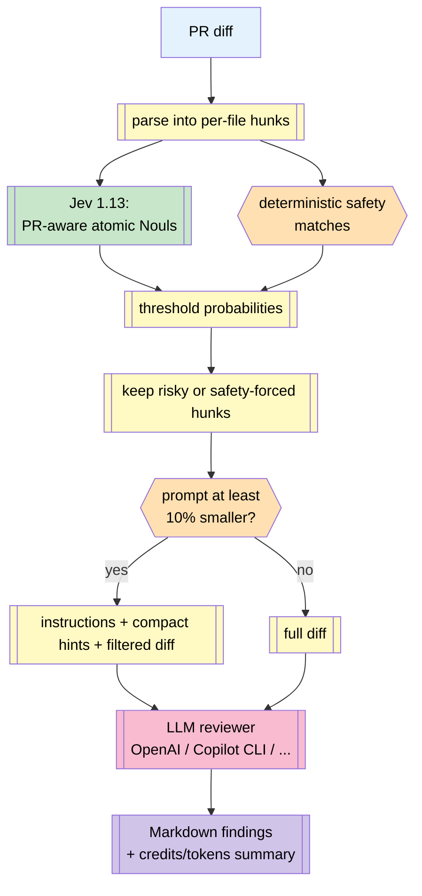

# Architecture

## The Node orchestrator pattern

`prune-review` is a Node.js orchestrator that mediates between two model
services. Jev is TypeSafe's System One decision model; the second service is a
generative reviewer. They never talk directly. All handoff happens via the
orchestrator.

## Where the tokens go

**LLM-only path:** whole diff → LLM. Every hunk (formatting, comments, resource
strings, real logic) pays full LLM tokens.

**Hybrid path:**
1. Jev receives the changed hunks as one PR-aware structured state. Two atomic
   Noul questions per hunk estimate whether omission could hide an actionable
   finding and whether the hunk is required context for another changed hunk.
   This lets each decision account for companion implementation and test changes.
   `jev-1.13.0` costs $0.042/M input tokens; output tokens are free as of
   2026-09-18.
2. Safety overrides and Jev probabilities select the cloud-review subset.
3. The filtered prompt is used only when it is at least 10% smaller.

Cloud credits and Jev dollars are reported separately; adding them would mix
provider-specific units. On a small PR (<10 hunks) the orchestrator
short-circuits to LLM-only below `min_hunks_for_triage`.

## Why Jev does not call the reviewer

Two orchestration models are possible:

1. **Node orchestrator (this project).** Deterministic pipeline. Jev emits
   structured verdicts; a script filters the diff; ONE LLM call happens with
   the seeded prompt. No agentic loop, no tool back-and-forth, predictable
   cost.
2. **LLM-driven via MCP.** The LLM is in the driver's seat and calls decision
   tools through MCP as it sees fit. More flexible, but a lot more tokens are
   spent coordinating and the LLM may not use the decision layer at all.

The Node orchestrator is what makes the cost savings reproducible. The MCP
server workspace (`prune-review-mcp`, not yet published to npm) exposes the
same tools to agent-driven flows for users who want them.
